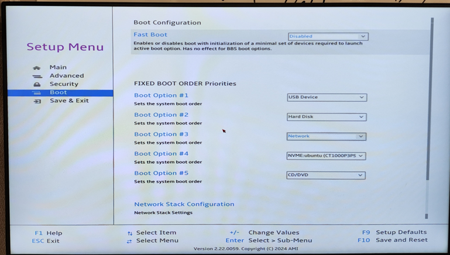

# 如何进入 BIOS（适用于 Windows 系统）

若您的设备运行的是 Windows，可按照以下路径进入 BIOS 设置界面：

**设置 → 系统 → 更新与安全 → 恢复 → 高级启动 → 立即重启**

系统将自动进入高级启动选项，在菜单中选择 **“UEFI 固件设置”** 即可进入 BIOS。

详细图文教程参考：[知乎教程 - Windows 10 如何进入 BIOS 设置](https://zhuanlan.zhihu.com/p/34223088#:~:text=Windows%2010%E5%A6%82%E4%BD%95%E8%BF%9B%E5%85%A5BIOS%E8%AE%BE%E7%BD%AE)

---

# 如何更改 BIOS 配置项

为确保 ROCm 在 APU 或 GPU 上正常运行，您需要在 BIOS 中进行以下设置调整：

### 1. **关闭安全启动（Secure Boot）**

进入 BIOS 后找到 **“Secure Boot”** 选项，将其设置为 **Disabled**。

---

### 2. **关闭快速启动（Fast Boot）**

---

### 3. **调整显存大小（iGPU UMA Frame Buffer Size）**

对于使用 iGPU 的 APU 系统（如 395），请在 BIOS 中设置共享显存大小，建议设置为系统内存的一半。

* 示例：3950 设备推荐设置为 **96GB**
如果能够运用UMA内存，请设置为最小512MB。（教程4）

路径： Advanced-AMD CBS-GFX

---

### 4. **保存更改并重启**

请按 BIOS 菜单提示键（通常为 F10）进行 **保存并退出**，系统将重新启动并应用设置。

---

# 如何升级 BIOS

### 1. **在主板官网查询并下载最新 BIOS**

访问您主板厂商的官方网站，输入设备型号，下载最新版 BIOS 固件：

---

### 2. **制作 EFI 启动盘**

* 使用 U 盘，格式化为 **FAT32 文件系统**
* 将下载的 BIOS 文件（通常是 `.efi` 或 `.cap` 文件）拷贝到 U 盘根目录

> 注意：文件通常不大，一般小于 10MB

---

### 3. **从 EFI 启动盘启动设备**

在 BIOS 中设置 **启动优先级**，让系统从该 U 盘启动。

---

### 4. **执行 BIOS 刷写操作**

根据厂商提供的说明，在 EFI 环境下执行 BIOS 刷写命令。

刷写完成后重启即可生效。

