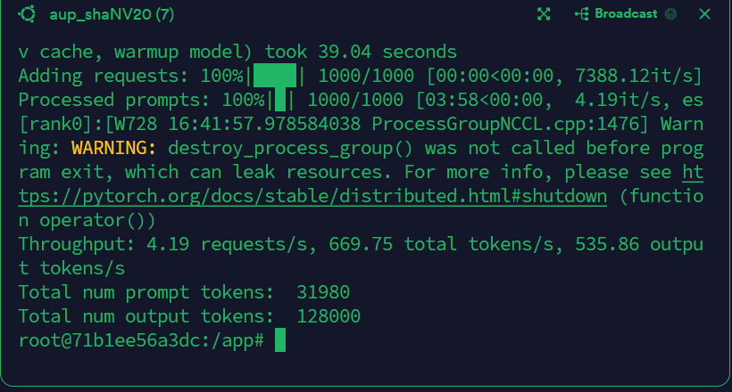
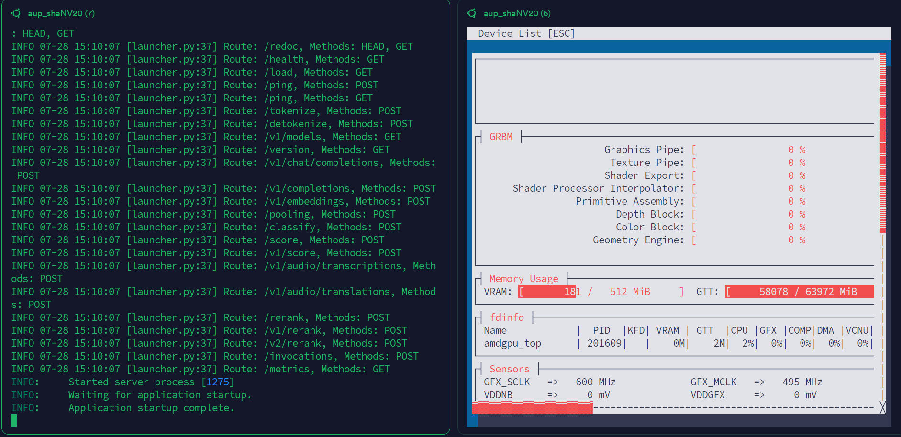

# 在 AI MAX 395 + ROCm 上使用 Docker 运行 VLLM（推理 Qwen2.5-7B）

---

## ✅ 条件确认（开始前请务必确保）

* [x] **系统版本**：Ubuntu 24.04.2
* [x] **ROCm 版本**：6.4.1 或以上
* [x] **硬件平台**：AI MAX 395（Strix-Halo 架构）
* [x] **已完成前置教程**：ROCm 安装与 Docker 使用（教程 4）
* [x] **已正确配置 BIOS**（关闭安全启动、UMA 显存设置、快速启动关闭）
* [x] **具备 sudo 权限**
* [x] **网络可访问 Docker Hub（docker.io）**

---

## 🎯 本节目标

* 成功运行 Docker 容器并部署 VLLM
* 加载并推理大模型 Qwen2.5-7B
* 进行简单调优，提升 395 APU 推理性能

---

## 📍 步骤 0：显存设置为 512MB（推荐）

按照教程0，进入 BIOS，将 **iGPU 显存大小** 设置为 **512MB **。此步骤对于运行大模型尤其关键。

---

## 📥 步骤 1：拉取 VLLM ROCm 镜像

ROCm 官方维护了适配 AMD GPU 的 VLLM 镜像，可直接从 Docker Hub 获取：

```bash
docker pull rocm/vllm:latest
```

---

## 🚀 步骤 2：启动带环境变量的 ROCm VLLM 容器

```bash
sudo docker run -it \
  --device=/dev/kfd \
  --device=/dev/dri \
  --security-opt seccomp=unconfined \
  --group-add video \
  -e HSA_OVERRIDE_GFX_VERSION=11.0.0 \
  rocm/vllm:latest
```

> 说明：
>
> * `HSA_OVERRIDE_GFX_VERSION=11.0.0` 是为 Strix-Halo（gfx1151） 显卡手动覆盖 GFX 版本，以便兼容 ROCm 工具链

---

## ✅ 步骤 3：运行 VLLM Benchmark 测试（确认可用性）

在容器内运行以下命令，验证 VLLM 能正确调度 AMD GPU：

```bash
vllm bench throughput \
  --model facebook/opt-1.3b \
  --tokenizer facebook/opt-1.3b \
  --input-len 32 \
  --output-len 128
```


若模型能正常加载并输出 `throughput` 结果，说明配置成功。

---

## 💬 步骤 4：加载并运行 Qwen2.5-7B 模型

### 在容器中运行：

```bash
vllm serve "Qwen/Qwen2.5-7B-Instruct"
```

容器会自动下载模型并启动推理服务，监听端口默认是 `8000`。



如果你需要调整VLLM默认占用的显存大小，你可以在以上命令里加入`--gpu-memory-utilization 0.5`


---

### 打开新的终端，获取容器 ID：

```bash
docker ps
```

进入容器：

```bash
docker exec -it <CONTAINER_ID> bash
```

### 发送测试请求：

```bash
curl -X POST "http://localhost:8000/v1/chat/completions" \
  -H "Content-Type: application/json" \
  --data '{
    "model": "Qwen/Qwen2.5-7B-Instruct",
    "messages": [
      {
        "role": "user",
        "content": "What is the capital of France?"
      }
    ]
  }'
```

如果返回包含 `"Paris"` 等回答，表示服务运行正常。


---

## ⚙️ 步骤 5：进行 AI MAX 395 性能调优（可选）

为获得更高的推理性能，可以参考社区文章：

🔗 [https://blog.hjc.im/strix-halo-local-llm.html](https://blog.hjc.im/strix-halo-local-llm.html)

### 示例：修改内核参数（开启大页 / 降低延迟）

编辑 grub 文件：

```bash
sudo vi /etc/default/grub
```

添加或修改以下参数（视实际情况而定）：

```bash
GRUB_CMDLINE_LINUX_DEFAULT="quiet splash transparent_hugepage=always"
```

然后更新 grub 并重启：

```bash
sudo update-grub
sudo reboot
```

---

## ✅ 小结

你现在已成功：

* 在 AI MAX 395 上通过 Docker 运行 VLLM
* 加载并使用 Qwen2.5-7B 进行自然语言推理
* 掌握了基本的模型服务请求与性能优化方法


